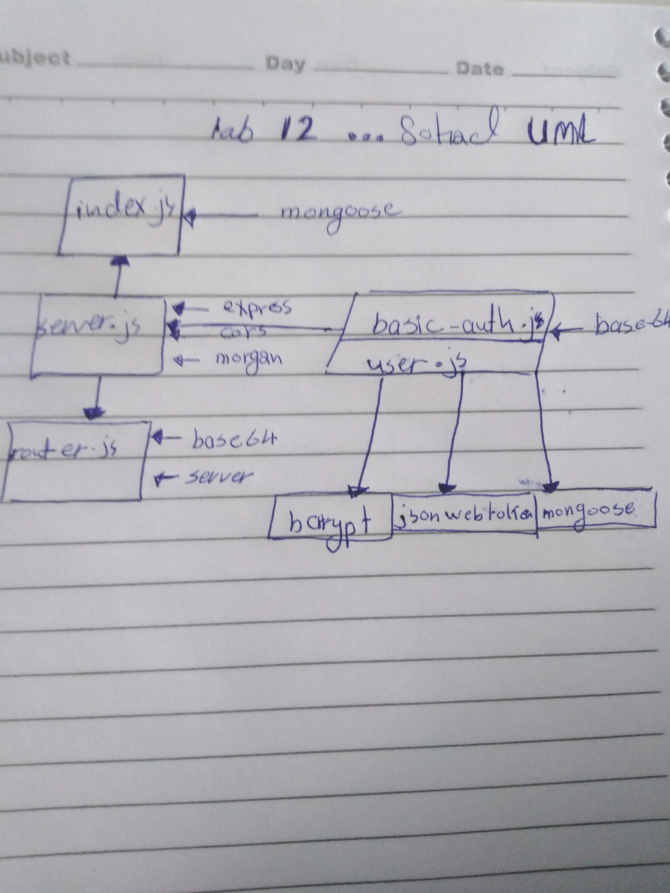

# LAB-12-OAuth
LAB: OAuth
# LAB - Class 12

### Author: Qusai-Alhanaktah

### Links and Resources

- [submission PR]()
- [ci/cd]( ) (GitHub Actions)

### Setup
npm i jest eslint

#### How to initialize/run your application (where applicable)

- `npm test`

#### Tests

- How do you run tests?
     - 'npm test'
- Any tests of note?
     - jest --verbose --coverage
- Describe any tests that you did not complete, skipped, etc
     - evey test solved and another time i will cover more cases.
### My-app-data

* CLIENT_SECRET=d64842ebec07d003530484b30e11b596e356c03b
* CLIENT_ID=96022cd56c276f8df64b

## Sohad Qtaitat

#### UML
Link to an image of the UML for your application and response to events
